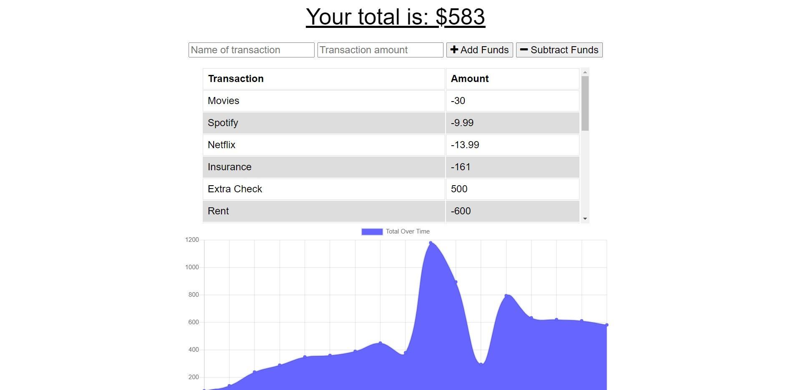

 []

  # Budget Tracker 

  ## Description
  Creating a progressive web application that manages expenses and functions while offline with the help of service workers and indexedDB.

  ## Table of Contents
  * [Installation](#installation)
  * [Usage](#usage)
  * [License](#license)
  * [Questions](#questions)
  
  ## Installation
  1. install express.js 
  2. install mongoose  
  3. install compression 
  4. install morgan  

  ## Usage
  The usage of this project is to manage your funds stating all of your transaction and if the amount was an addition or subtraction.
    
  Deployed application link: 
   
  

  ## License
  This licence is covered undered (https://opendatacommons.org/licenses/odbl/).
  

  ## Questions
  If you have any additional questions, please reach out to me. 
  You can reachout to me at my GitHub profile, which is [reaganjoseph26](https://github.com/reaganjoseph26).
  Also, you can reach out to me by email. My email address is reaganjoseph26@yahoo.com. 
  